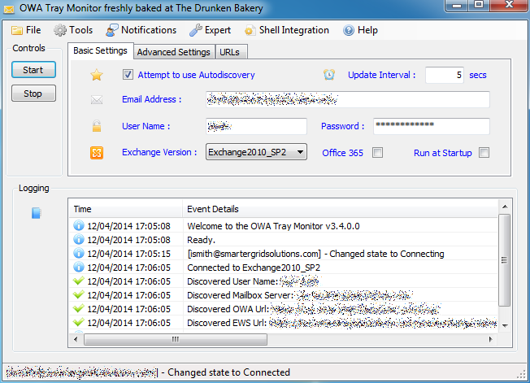

# OWAtray — OWA Tray Monitor

[](https://github.com/issinoho/owatray/releases/latest)
[](https://github.com/issinoho/owatray/actions/workflows/build.yml)

**[issinoho.github.io/owatray](https://issinoho.github.io/owatray/)** — landing page with features,
compatibility, and download link (source in [`docs/`](docs/)). See [`CHANGELOG.md`](CHANGELOG.md) for
what's changed release to release.

OWAtray is a Windows system-tray application that watches an Exchange or Office 365 mailbox and lets
you know when new mail or upcoming calendar appointments arrive, without needing Outlook running. It
can also register itself as your system's default (Simple MAPI) mail handler, so that "Send to Mail
Recipient" style actions from other Windows apps open a compose window in Outlook Web Access instead of
launching Outlook.

<table>
<tr><td>



</td><td valign="bottom">


</td></tr>
</table>

*The main window and a new-mail notification, v3.4.0.0 — recovered from the [Internet
Archive](https://web.archive.org/web/20180716043552/http://www.owatray.com/_/rsrc/1397319636584/home/MainApp.png)
copy of the original owatray.com.*

## Features

- Polls a mailbox over Exchange Web Services (EWS) on a configurable interval and shows the unread
  count and new-mail details.
- Calendar polling with reminders for upcoming appointments.
- Autodiscovery of the EWS service URL and OWA URL from an email address, with the option to override
  either manually (e.g. for on-premise Exchange with non-standard URLs, or split-DNS setups).
- Works against on-premise Exchange (with a selectable server version, from Exchange 2007 SP1 through
  2019 and Server SE) and Office 365 — see [Supported Exchange versions](#supported-exchange-versions).
- Notifications via the native Windows tray balloon (which the OS itself renders as a modern Action
  Center toast on Windows 10/11), plus an optional notification sound.
- Acts as a Simple MAPI provider: other applications that "send via MAPI" get handed off to OWAtray,
  which opens a new-message (or new-appointment) compose window in a browser against OWA instead of
  requiring Outlook to be installed. Can be switched on/off per-machine from the Advanced menu ("Make
  OWA the default mail handler" / "Switch off shell integration").
- Optional auto-login: OWAtray can drive the OWA/Office 365 login page for you using a saved,
  encrypted password.
- Runs at Windows startup, works with the system default web proxy, and can operate against machines
  joined to (or not joined to) a Windows domain.
- Localized into English, German, Italian, Turkish, Catalan, Macedonian, Russian, Polish, French,
  Spanish and Czech.

## Requirements

- Windows, with the .NET Framework 4.0 runtime.
- An Exchange (on-premise, with EWS enabled) or Office 365 mailbox to connect to.

## Installing

Download `OWAtray.exe` from the [latest release](https://github.com/issinoho/owatray/releases/latest)
and run it, or build it yourself — see below. It's built from `Installer/OWAtray.nsi` (an NSIS script)
by the [`build` workflow](.github/workflows/build.yml) whenever a version tag is pushed. The installer
installs per-user (`$APPDATA\OWAtray`, `RequestExecutionLevel user`) and does not require admin rights.

## Building from source

Requires Windows with Visual Studio (or MSBuild) and the VC++ toolset (for the native `Mapi` project).

```
nuget restore OWAtray.sln
msbuild OWAtray.sln /p:Configuration=Release
```

`src/Tests` has an NUnit unit test suite covering the non-UI logic (scenario save/load, connection
defaults, the Exchange version resolver, etc.):

```
msbuild OWAtray.sln /t:DrunkenBakery_OWAtray_Tests /p:Configuration=Debug
nunit3-console src/Tests/bin/Debug/DrunkenBakery.OWAtray.Tests.dll
```

Every C# project also has [StyleCop.Analyzers](https://github.com/DotNetAnalyzers/StyleCopAnalyzers)
wired in and runs as part of a normal build — no separate lint step. See `CLAUDE.md` for which rules are
deliberately turned off and why.

It doesn't cover EWS network calls, the WinForms GUI, or the MAPI/shell integration — validate those by
running `DrunkenBakery.OWAtray.GUI.exe` against a real (or test) Exchange/EWS mailbox. See `CLAUDE.md`
for a fuller breakdown of the project layout and conventions if you're working on the codebase.

## Configuration

Settings are entered on the main window's **Account** tab (email address, username/password, server,
domain, description, poll interval) and **Advanced** tab (autodiscovery on/off with manual EWS/OWA URL
override, Exchange server version, Office 365 toggle, always-use-Internet-Explorer, disable calendar
polling, auto-login, run on startup, use the system default web proxy, on-Windows-domain, override
SSL/TLS certificate validation, override autodiscovery validation). Settings are persisted to an XML
"Scenario" file so they survive restarts.

## Supported Exchange versions

The Account tab's server-version selector supports:

| Selection | Notes |
|---|---|
| Default | No explicit version is sent to the EWS Managed API — the server auto-negotiates. |
| Exchange2007_SP1 | |
| Exchange2010 | |
| Exchange2010_SP1 | |
| Exchange2010_SP2 | |
| Exchange2010_SP3 | The EWS Managed API has no distinct enum value for SP3, so the connection actually negotiates as `Exchange2010_SP2` under the hood but is displayed/stored as SP3. |
| Exchange2013 | Also covers Office 365, which reports as Exchange2013-family. |
| Exchange2013_SP1 | |
| Exchange2016 | Wire-compatible with Exchange 2013 SP1 — negotiates using the 2013 SP1 schema, since the EWS protocol didn't change and the bundled EWS Managed API predates this server version. |
| Exchange2019 | Same as Exchange 2016 — negotiates using the 2013 SP1 schema. |
| ExchangeServerSE (Subscription Edition) | Same as Exchange 2016/2019 — negotiates using the 2013 SP1 schema. |

The same version also selects the OWA compose-URL format used for MAPI/shell integration: Exchange
2013 and newer (including Office 365) use the newer compose-URL format, everything from Exchange 2007
through 2010 uses the legacy MIME-URL format.

Note: this covers on-premises Exchange. For Exchange Online/Office 365, EWS Basic Authentication
(username + password, which is all this app currently supports) was disabled for most tenants in
October 2022 — connecting to a modern Microsoft 365 mailbox requires OAuth 2.0 ("Modern Auth"), which
is not yet implemented.

## License

OWAtray is freeware (see `src/GUI/License.txt`). You may use it freely, including within a company,
but you may not bundle it with or sell it as part of a commercial product. If you roll it out in a
corporate environment, make sure your users direct support questions to you rather than to the OWAtray
author.

## Translations

Thanks to the following volunteer translators (from the app's Contact Us dialog):

| Language | Translator |
|---|---|
| Catalan | Daniel Sabater |
| German | Christian Treudler |
| Spanish | Daniel Sabater |
| Turkish | pi511 |
| French | Marc Lairet |
| Italian | Marco Procida |
| Russian | Aleksandr Bembel |
| Polish | Ryszard Ostrowski |
| Macedonian | Igor Vojnoski |
| Czech | Jiri Kubinek |
